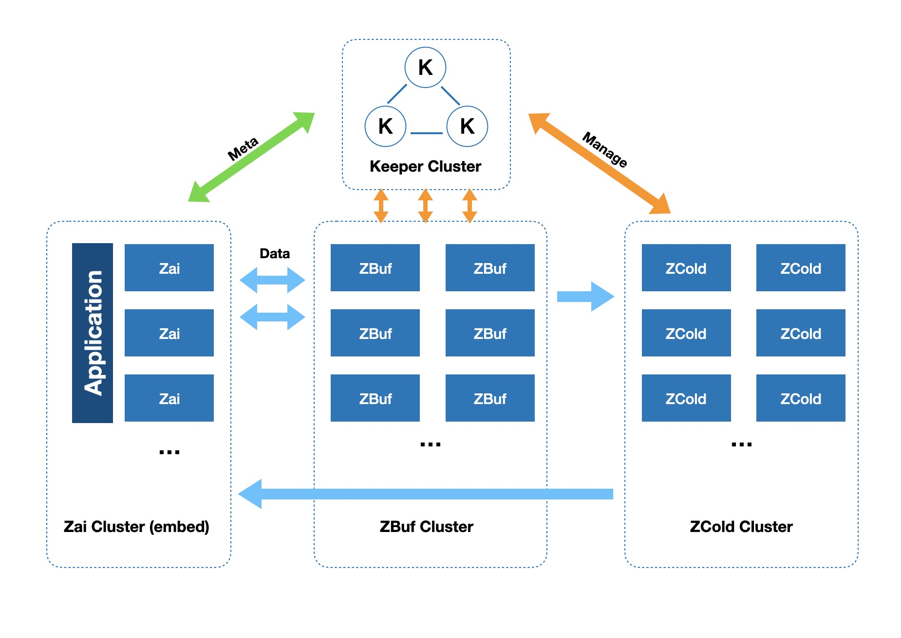

Components
===

The Zai cluster is comprised of four key components in present: 

1. Zai
2. Keeper
3. ZBuf
4. ZCold

## Zai

The Zai is the Input/Output service: Receiving the requests and Returning the result.

The Zai is stateless, so it's horizontally scalable. Access it through load balancing components such as LVS, F5.

And it can be embedded into user's application.

## Keeper

Keeper is the managing component of the entire Zai box. 

There is only one keeper node is active, remaining keeper servers available for high availability only. 

It is recommended to deploy keeper at least three nodes.

## ZBuf

ZBuf is using for store data temporally for higher performance.

## ZCold

When data gets cold, data would be in Store with cheaper devices and lower storage redundancy (compare with ZBuf).

If all your data will be deleted soon(e.g. video surveillance, objects may only keep for 30days), 
there is no need to deploy ZCold nodes, just set EnableDiscard = true in keeper.Config. 
Discard will delete data after days you set.

