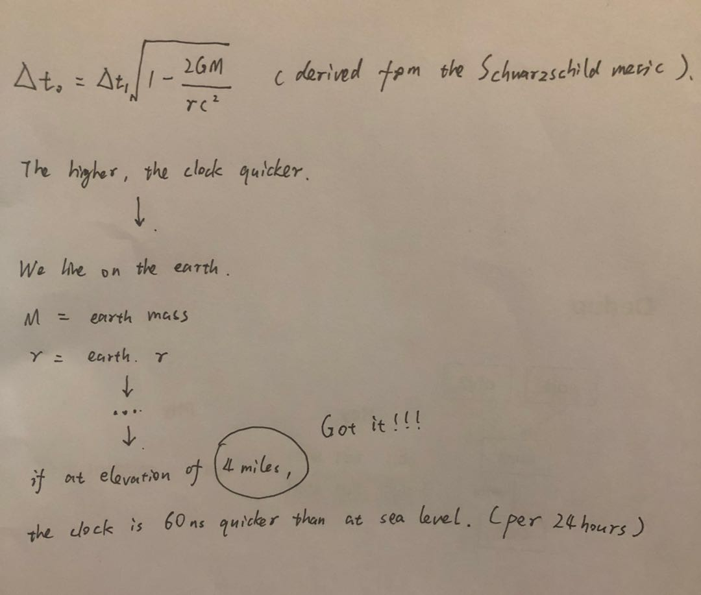

Why 4mile
===

In [FAQ](FAQ.md), I have answered the question about "Up to 2814 trillions objects".
And if we have 31boxes (older version limitation when project name is still 4mile), 
it will up to 85.2 trillions in a single namespace.

## Naming Steps

1. Assume 70% usage, that means about 60 trillions.
   So the target is 60.

2. Something about General relativity...

ps:

1. 

    var (
	    G float64 = 6.67408e-11
	    c float64 = 299792458
	    r float64 = 6378137
	    M float64 = 5.972e24
    )

2. 

If r = 2GM/c^2, we still see the clock is ∞ slow, a Black Hole! :D

## But Why

Too many storage companies bluff. (They can hold ∞ users, ∞ bucket, ∞ files, ∞ request, ∞ nodes...)

I want to know the accurate number, I don't like bluff. And I think I did well in Zai,
so I should give Zai a name which has a accurate source.

Trillion is too big for normal stuff, hard to get a name. So I have to look up at the starry sky,
and ask the general relativity for help.

## Warning

If I made mistakes in math, just ignore them. :D